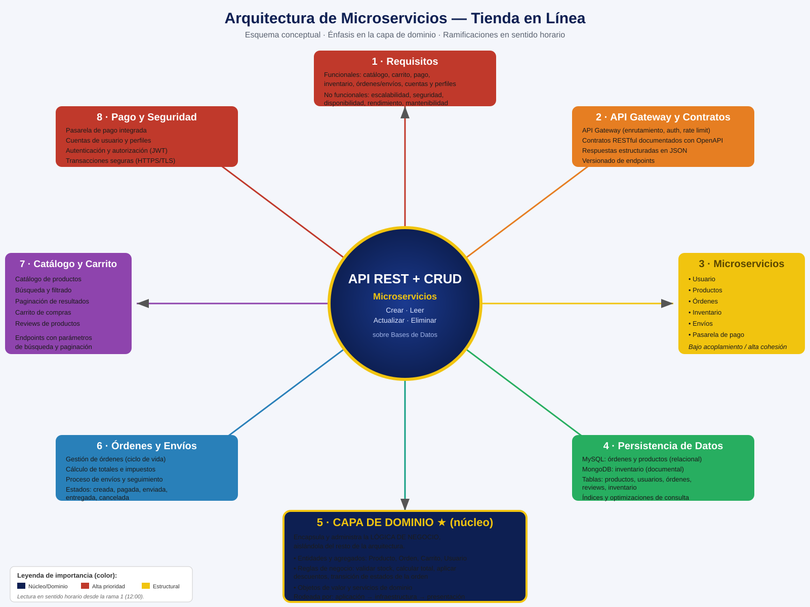

# Esquema Conceptual — Arquitectura de Microservicios para una Tienda en Línea

**Actividad Semana 4 · Corporación Universitaria Minuto de Dios – UNIMINUTO**

Este repositorio contiene el esquema conceptual de una arquitectura de software basada en
**microservicios** para una tienda en línea. La idea central es el diseño de una **API que
vincula operaciones CRUD** (crear, leer, actualizar, eliminar) a bases de datos, con **énfasis
en la capa de dominio**.

---

## Mapa conceptual

> Las ramas se leen **en sentido horario** desde la rama 1 (arriba) y están coloreadas por
> nivel de importancia. La **capa de dominio** (rama 5, en azul con borde dorado) es el núcleo
> que encapsula la lógica de negocio.

---

## Capas arquitectónicas (énfasis en el dominio)

| Capa | Responsabilidad |
|------|-----------------|
| Presentación / API | Expone los endpoints RESTful; traduce HTTP en llamadas de aplicación. |
| Aplicación | Orquesta los casos de uso (crear orden, procesar pago) sin reglas de negocio. |
| **Dominio (núcleo)** | **Encapsula y administra la lógica de negocio**: entidades y agregados (Producto, Orden, Carrito, Usuario), objetos de valor, reglas (validar stock, calcular total, aplicar descuentos, transiciones de estado de la orden) y servicios de dominio. |
| Infraestructura | Persistencia (MySQL y MongoDB), mensajería e integración con la pasarela de pago. |

El aislamiento de la capa de dominio permite que las reglas de negocio no dependan de la
tecnología de bases de datos ni de los frameworks, favoreciendo la mantenibilidad, la
capacidad de prueba y la escalabilidad.

---

## Microservicios y persistencia

- **API Gateway**: punto único de entrada (enrutamiento, autenticación, control de tasa).
- Microservicios: **Usuario, Productos, Órdenes, Inventario, Envíos, Pasarela de Pago**.
- **MySQL** (relacional): órdenes y productos — tablas de productos, usuarios, órdenes, reviews.
- **MongoDB** (documental): inventario.
- Índices y optimizaciones para búsquedas y consultas frecuentes.

---

## Contratos de API (OpenAPI 3.0)

El archivo [`openapi_tienda_microservicios.json`](openapi_tienda_microservicios.json) define los
endpoints RESTful con respuestas en JSON:

- `GET/POST /products`, `GET/PUT/DELETE /products/{id}` — con búsqueda, filtrado y paginación.
- `GET/POST/DELETE /cart/{userId}` — carrito de compras.
- `GET/POST /orders`, `GET /orders/{id}` — órdenes.
- `POST/GET /shipments`, `/shipments/{id}` — envíos y seguimiento.
- `POST /payments` — pasarela de pago.
- `GET /inventory/{productId}` — inventario.

> Puedes visualizar y editar este contrato en [editor.swagger.io](https://editor.swagger.io/)
> pegando el contenido del JSON.

---

## Archivos del repositorio

| Archivo | Descripción |
|---------|-------------|
| `esquema_arquitectura_microservicios.svg` | Mapa conceptual (se renderiza aquí en GitHub). |
| `esquema_arquitectura_microservicios.pdf` | Mismo mapa en PDF para entrega. |
| `openapi_tienda_microservicios.json` | Contrato OpenAPI 3.0. |
| `Entrega_Semana4.docx` | Documento de entrega para la plataforma del curso. |

---

## Fuentes de consulta (APA)

- Evans, E. (2004). *Domain-Driven Design: Tackling Complexity in the Heart of Software*. Addison-Wesley.
- Newman, S. (2021). *Building Microservices: Designing Fine-Grained Systems* (2.ª ed.). O'Reilly Media.
- Richardson, C. (2018). *Microservices Patterns: With Examples in Java*. Manning Publications.
- OpenAPI Initiative. (2021). *OpenAPI Specification v3.1.0*. https://www.openapis.org/
